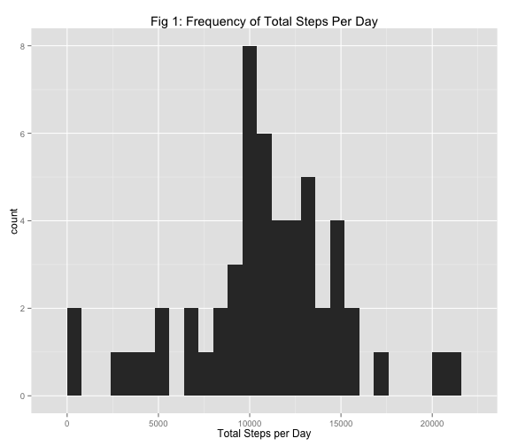

# Reproducible Research: Peer Assessment 1
The following report represents the steps, code and output I completed
for this assignment. The data for this assignment is from a personal 
activity monitoring device. This device collects data at 5-minute intervals 
throughout the day. The data consists of two months of data from an 
anonymous individual collected during the months of October and November, 
2012 and include the number of steps taken in 5-minute intervals each day.

The variables included in this dataset are:

* **steps**: Number of steps taking in a 5-minute interval (missing
    values are coded as `NA`).

* **date**: The date on which the measurement was taken in YYYY-MM-DD
    format.

* **interval**: Identifier for the 5-minute interval in which the
    measurement was taken.

The dataset is stored in a comma-separated-value (CSV) file and there
are a total of 17,568 observations in this dataset. The dataset can be 
downloaded here: [Activity monitoring data](https://d396qusza40orc.cloudfront.net/repdata%2Fdata%2Factivity.zip) [52K]

## Loading and preprocessing the data

To load the data, I used the following code. I prefer to use fread but read.csv and read.table
work as well. The only processing of the data I did at this point was to make the "date" 
variable into a date class and the "interval" variable as a factor. Additional processing/transformation takes place at later steps depending on the question being answered.


```r
library(data.table)
activity <- fread("activity.csv")
activity$date <- as.Date(activity$date, "%Y-%m-%d")
activity$interval <- as.factor(activity$interval)
```


## What is the mean total number of steps taken per day?

To calculate the mean total number of steps per day, I used the ddply function from the plyr package. I created a new data frame with a new variable "totalsteps", which took the sum of all the steps for each day.


```r
library(plyr)
steps.day <- ddply(activity, .(date), summarize, totalsteps = sum(steps))
```

Then, with this new data set, I created a histogram of the total steps per day ignoring the missing values as per the instructions. The frequencies create a fairly normal distribution, with the highest frequency occurring around the 10,000 step mark.


```r
library(ggplot2)
ggplot(data = steps.day, aes(x = totalsteps)) + geom_histogram(binwidth = 800) + 
    labs(x = "Total Steps per Day") + labs(title = "Fig 1: Frequency of Total Steps Per Day")
```

 


To get the mean and median of the total steps, I used the summary function since it is able to calculate it even though some dates had "NA" associated with them. The median of the total steps taken per day is 10,760 and the mean of the total steps taken per day is 10,770.


```r
summary(steps.day$totalsteps, digits=4)
```

```
##    Min. 1st Qu.  Median    Mean 3rd Qu.    Max.    NA's 
##      41    8841   10760   10770   13290   21190       8
```

## What is the average daily activity pattern?

To understand the average daily activity pattern, I created a time-series plot of the 5-minute interval and the average number of steps taken, averaged across all days. To do this, I created a new matrix to work with. First, I took out the rows with missing values. Then, I used ddply to get the mean steps for each 5 minute interval. I then created a second interval variable called "interval2" to change the interval values from factor to integer to graph the intervals on the x-axis.


```r
average.interval <- activity[complete.cases(activity), ]
average.interval <- ddply(activity, .(interval), summarise, mean_steps = mean(steps, na.rm = TRUE))
average.interval$interval2 <- as.integer(as.character(average.interval$interval))
g <- ggplot(average.interval, aes(x = interval2, y = mean_steps))
g + geom_line() + labs(x = "5 Minute Interval") + labs(y="Average Number of Steps") + labs(title = "Fig 2: Average Number of Steps per 5-Minute Interval")
```

 

To compute the 5-minute interval that had the maximum average steps taken, I used the following code to determine that interval 835 has the highest mean steps of 206. Each interval represents a clock time such that interval 0 is 12:00am, interval 5 is 12:05am, etc. Therefore, this individual walks the most at 8:35am.


```r
average.interval[(average.interval$mean_steps == max(average.interval$mean_steps)), ]
```

```
##     interval mean_steps interval2
## 104      835      206.2       835
```

## Imputing missing values

Because the presence of missing values could introduce bias, this next section is an analysis of missing values and imputing values for them. This data set contained 2,304 missing values in the "steps" variable.


```r
colSums(is.na(activity))
```

```
##    steps     date interval 
##     2304        0        0
```

To impute values for the missing data, I first created a new data frame to preserve the original data frame. I then replaced each NA with the average steps for that interval.

```r
NewActivity <- activity
for(i in 1:17568)
    if(is.na(NewActivity$steps[i]) == TRUE) {
      NewActivity$steps[i] <- average.interval$mean_steps[NewActivity$interval[i]==average.interval$interval]
}
```

The following output shows that the missing values have been replaced by comparing the summary statistics of the "steps" variable in the activity data frame with the summary statistics of the "steps" variable in the NewActivity data frame.


```r
summary(activity$steps)
```

```
##    Min. 1st Qu.  Median    Mean 3rd Qu.    Max.    NA's 
##     0.0     0.0     0.0    37.4    12.0   806.0    2304
```

```r
summary(NewActivity$steps)
```

```
##    Min. 1st Qu.  Median    Mean 3rd Qu.    Max. 
##     0.0     0.0     0.0    37.4    27.0   806.0
```

Next, I created a histogram with the new data set with imputed missing values.


```r
Newsteps.day <- ddply(NewActivity, .(date), summarize, totalsteps = sum(steps))
library(ggplot2)
ggplot(data = Newsteps.day, aes(x = totalsteps)) + geom_histogram(binwidth=800) + labs(x = "Total Steps per Day") + labs(title = "Fig 3: Frequency of Total Steps Per Day with Imputed Missing Values")
```

 

This new histogram looks similar to "Fig. 1" except for the fact that the counts are higher which makes sense given that the missing values were replaced with numbers as opposed to not being used. 

Comparing the summaries of the data with the imputed missing values with the data with missing values, we see that both data sets are relatively similar. The main difference is in the 1st and 3rd quartiles, but given that imputing the missing values adds more numbers (or usable observations) to the data set these changes make sense. This suggests that there is minimal impact of imputing missing data on the estimates of the total daily number of steps when using the average number of steps per interval.


```r
summary(steps.day$totalsteps, digits=4)
```

```
##    Min. 1st Qu.  Median    Mean 3rd Qu.    Max.    NA's 
##      41    8841   10760   10770   13290   21190       8
```

```r
summary(Newsteps.day$totalsteps, digits=4)
```

```
##    Min. 1st Qu.  Median    Mean 3rd Qu.    Max. 
##      41    9819   10770   10770   12810   21190
```

## Are there differences in activity patterns between weekdays and weekends?

To assess whether or not there are differences in activity patterns on weekdays and weekends, I created a new variable in the NewActivity data set. I used the data set with the imputed values as per the directions.


```r
NewActivity$weekday <- ifelse(wday(NewActivity$date)>1 & wday(NewActivity$date)<7, "weekday", "weekend")
NewActivity$weekday <- as.factor(NewActivity$weekday)
```

Next, I created a time series plot panel plot of the 5-minute interval on the x-axis and the average number of steps taken, averaged across all weekdays or weekends on the y-axis. I used similar steps above to create a new integer class interval variable for graphing purposes.


```r
NewActivityInterval <- ddply(NewActivity, .(interval, weekday), summarise, mean_steps = mean(steps, na.rm = TRUE))
NewActivityInterval$interval2 <- as.integer(as.character(NewActivityInterval$interval))
g <- ggplot(NewActivityInterval, aes(x = interval2, y = mean_steps))
g + geom_line() + facet_wrap(~ weekday, nrow=2) + labs(x = "Interval") + labs(y = "Number of Steps") + labs(title = "Fig 4: Average Number of Steps Per Interval by Weekday and Weekend")
```

 

From these graphs, we see that the individual who contributed to this data set tended to take the most steps between 5:00am and 10:00am on the weekdays where on the weekends this person's steps are somewhat consistent during day light hours.
